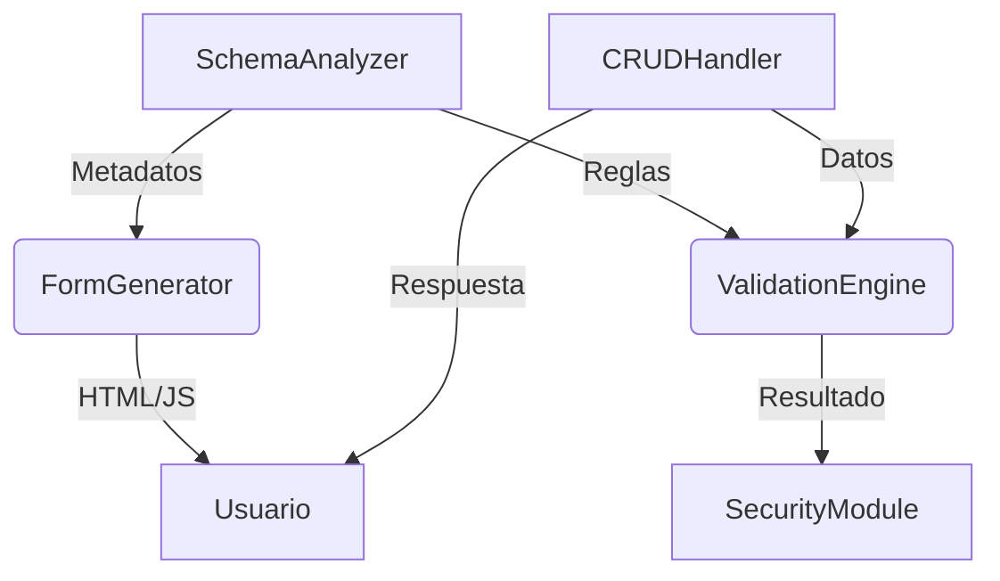

### **Documento Técnico: Sistema Dinámico de Formularios CRUD con Validación Automática**
#### **Nombre del Proyecto**: `DynamicCRUD`

---

#### **1. Objetivo Principal**
Crear una librería en PHP que genere **formularios CRUD dinámicos** (HTML/JS) y gestione validaciones (cliente/servidor) basándose **exclusivamente en la estructura de una tabla SQL** y metadatos adicionales (ej: tipo de campo `email`), sin generar código estático. Debe adaptarse automáticamente a cambios en la base de datos.

---

#### **2. Requisitos Clave**
- **Introspección de la BD**: Leer en tiempo real la estructura de una tabla (columnas, tipos, constraints).
- **Metadatos Extendidos**: Permitir definir reglas de validación adicionales (ej: `url`, `email`) sin depender solo de tipos SQL.
- **Seguridad Integrada**: Protección contra CSRF, SQL injection, XSS y saneamiento de datos.
- **Flexibilidad**: 
  - Personalizar estilos y comportamientos (ej: selectores para claves foráneas).
  - Soportar campos compuestos (ej: subir archivos → guardar ruta en un `VARCHAR`).
- **Rendimiento**: Caché de esquemas de tablas para evitar consultas repetidas a `INFORMATION_SCHEMA`.

---

#### **3. Arquitectura del Sistema**
La librería se dividirá en 5 módulos interconectados:



##### **3.1. SchemaAnalyzer**
- **Función**: Extraer información de la tabla (columnas, tipos, constraints) y metadatos personalizados.
- **Fuentes de datos**:
  - `INFORMATION_SCHEMA.COLUMNS` (tipos SQL, nulabilidad, claves).
  - **Metadatos personalizados**: Comentarios en columnas o un archivo de configuración JSON (ej: `comments = '{"type": "email"}'`).
- **Salida**: Estructura normalizada como:
  ```php
  [
    'name' => 'email',
    'sql_type' => 'VARCHAR(255)',
    'is_nullable' => false,
    'metadata' => ['type' => 'email', 'label' => 'Correo electrónico']
  ]
  ```

##### **3.2. FormGenerator**
- **Función**: Generar HTML/JS dinámico basado en los metadatos.
- **Mapeo de Tipos**:
  | Tipo SQL/Metadata      | Input HTML               | Validación JS                     |
  |------------------------|--------------------------|-----------------------------------|
  | `INT`                  | `<input type="number">`  | `min`, `max`                     |
  | `VARCHAR` + `email`    | `<input type="email">`   | Expresión regular para emails    |
  | `DATE`                 | `<input type="date">`    | Formato YYYY-MM-DD               |
  | Clave foránea          | `<select>`               | Cargar opciones vía AJAX         |
- **Características**:
  - Inyectar tokens CSRF automáticamente.
  - Atributos `required` según constraints `NOT NULL`.
  - Soporte para plantillas personalizables (ej: usar Bootstrap).

##### **3.3. ValidationEngine**
- **Capas de validación**:
  1. **Servidor (PHP)**:
     - Tipos SQL: Convertir y validar (ej: `INT` → filtrar con `FILTER_VALIDATE_INT`).
     - Reglas personalizadas: `filter_var($value, FILTER_VALIDATE_EMAIL)` para campos `email`.
     - Longitudes máximas (ej: `VARCHAR(255)`).
  2. **Cliente (JS)**:
     - Reglas básicas vía atributos HTML5 (`required`, `pattern`).
     - Validación asíncrona para unicidad (ej: "email ya existe").
- **Respuesta**: Devolver errores estructurados para mostrar en el formulario.

##### **3.4. CRUDHandler**
- **Endpoints**:
  - `GET /form?table=users&id=5`: Renderiza formulario de edición.
  - `POST /submit?table=users`: Procesa datos de creación/edición.
- **Flujo**:
  1. Validar token CSRF.
  2. Ejecutar `ValidationEngine`.
  3. Si hay errores → devolver formulario con mensajes.
  4. Si es válido → ejecutar consulta SQL con **sentencias preparadas**.

##### **3.5. SecurityModule**
- **Protecciones**:
  - **CSRF**: Generar token por sesión y validar en cada `POST/PUT`.
  - **Saneamiento**: Usar `htmlspecialchars` para salida HTML y `filter_var` para entradas.
  - **Inyección SQL**: Todas las consultas usan PDO con parámetros enlazados.
  - **Listas blancas**: Solo permitir columnas definidas en el esquema (evitar *mass assignment*).

---

#### **4. Configuración de Metadatos Personalizados**
Para definir reglas como `email` o `url`, se usarán **comentarios en las columnas de la BD** en formato JSON:
```sql
ALTER TABLE users 
MODIFY COLUMN email VARCHAR(255) COMMENT '{"type": "email", "label": "Tu correo"}';
```
Alternativa: Archivo de configuración `metadata.json`:
```json
{
  "users": {
    "email": {"type": "email", "required": true}
  }
}
```

---

#### **5. Ejemplo de Uso**
```php
require 'DynamicCRUD.php';

$pdo = new PDO('mysql:host=localhost;dbname=test', 'user', 'pass');
$crud = new DynamicCRUD($pdo, 'users'); // Tabla 'users'

if ($_SERVER['REQUEST_METHOD'] === 'POST') {
  $crud->handleSubmission(); // Procesa POST/PUT
} else {
  echo $crud->renderForm($_GET['id'] ?? null); // Muestra formulario (nuevo/edición)
}
```

---

#### **6. Casos de Borde a Considerar**
- **Claves foráneas**: Mostrar `<select>` con datos de tablas relacionadas (ej: `category_id` → opciones de `categories.name`).
- **Campos calculados**: Excluir columnas como `created_at` si son gestionadas por la BD.
- **Archivos**: Mapear un campo `file_path` (VARCHAR) a un `<input type="file">` con subida a servidor.
- **Internacionalización**: Etiquetas y mensajes de error en múltiples idiomas.
- **Relaciones muchos-a-muchos**: Tablas pivot con checkboxes múltiples.
- **Relaciones polimórficas**: Campos que referencian múltiples tablas.
- **Tipos especiales**: JSON (editor visual), ENUM (radio/select), SET (checkboxes), GEOMETRY (mapas).
- **Límite de complejidad**: Tablas con 100+ columnas pueden afectar rendimiento.

---

#### **7. Tecnologías Recomendadas**
- **PHP 8.0+**: Por typed properties y mejor manejo de errores.
- **PDO**: Para abstracción de base de datos y seguridad.
- **JavaScript moderno**: Validación asíncrona con Fetch API.
- **Caché**: Almacenar esquemas en `APCu`, Redis o Memcached para reducir consultas a `INFORMATION_SCHEMA`.
- **Composer**: Para gestión de dependencias y distribución vía Packagist.
- **PHPUnit + Selenium**: Para pruebas unitarias y end-to-end.

---

#### **8. Pruebas Clave**
1. **Inyección SQL**: Intentar inyectar código malicioso en campos.
2. **CSRF**: Enviar formulario sin token válido.
3. **Tipos inválidos**: Enviar texto en un campo `INT`.
4. **Rendimiento**: Medir tiempo de generación con tablas de 50+ columnas.
5. **Accesibilidad**: Validar ARIA labels y navegación por teclado.
6. **Compatibilidad BD**: Probar diferencias entre MySQL y PostgreSQL en `INFORMATION_SCHEMA`.

---

#### **9. Mejoras y Características Avanzadas**

##### **9.1. Sistema de Caché Robusto**
- Soportar múltiples estrategias: APCu, Redis, Memcached, archivos.
- Invalidación automática al detectar cambios en esquema.
- Versionado de esquemas para detectar modificaciones.
```php
interface CacheStrategy {
    public function get(string $key);
    public function set(string $key, $value, int $ttl);
    public function invalidate(string $pattern);
}
```

##### **9.2. Validadores Personalizados**
- Sistema extensible de validación:
```json
{
  "users": {
    "age": {
      "type": "int",
      "validators": ["min:18", "max:120"],
      "custom": "App\\Validators\\AgeValidator"
    }
  }
}
```

##### **9.3. Sistema de Eventos/Hooks**
- Permitir lógica personalizada en puntos clave:
```php
$crud->beforeSave(function($data) {
    $data['slug'] = slugify($data['title']);
    return $data;
});

$crud->afterCreate(function($id, $data) {
    // Enviar email, log, etc.
});
```

##### **9.4. Campos Condicionales**
- Mostrar/ocultar campos según valores:
```json
{
  "payment_method": {
    "type": "select",
    "options": ["card", "paypal"],
    "shows": {
      "card": ["card_number", "cvv"],
      "paypal": ["paypal_email"]
    }
  }
}
```

##### **9.5. Paginación y Filtros**
- Para listados (operación READ):
```php
$crud->list([
    'page' => 1,
    'perPage' => 20,
    'filters' => ['status' => 'active'],
    'sort' => ['created_at' => 'DESC']
]);
```

##### **9.6. Sistema de Auditoría**
- Registro automático de cambios:
```sql
CREATE TABLE crud_audit (
    id INT PRIMARY KEY AUTO_INCREMENT,
    table_name VARCHAR(64),
    record_id INT,
    action ENUM('create','update','delete'),
    old_values JSON,
    new_values JSON,
    user_id INT,
    created_at TIMESTAMP DEFAULT CURRENT_TIMESTAMP
);
```

##### **9.7. Campos Repetibles**
- Para arrays de datos (ej: múltiples teléfonos):
```html
<div class="repeater">
  <input name="phones[]" type="tel">
  <button class="add-more">+</button>
</div>
```

##### **9.8. Internacionalización Avanzada**
- Validación de formatos locales:
```php
'phone' => [
    'type' => 'tel',
    'locale' => 'es_MX',
    'pattern' => '/^\d{10}$/'
]
```

---

#### **10. Límites del Proyecto**
La librería NO incluirá:
- Reportes complejos o dashboards analíticos.
- Gestión de permisos/roles (debe integrarse externamente).
- Workflows complejos o máquinas de estado.
- Generación de APIs REST (solo formularios HTML).
- Migraciones de base de datos.

---

#### **11. Fases de Implementación**

##### **Fase 1: MVP (Producto Mínimo Viable)**
**Objetivo**: Sistema funcional básico con operaciones CRUD esenciales.

**Tareas**:
1. **SchemaAnalyzer**:
   - Lectura de `INFORMATION_SCHEMA` para MySQL.
   - Extracción de columnas, tipos, constraints y claves primarias.
   - Soporte para metadatos en comentarios JSON.

2. **FormGenerator**:
   - Mapeo básico: `INT`, `VARCHAR`, `TEXT`, `DATE`, `DATETIME`, `BOOLEAN`.
   - Generación de HTML con atributos `required` y `maxlength`.
   - Inyección automática de tokens CSRF.

3. **ValidationEngine**:
   - Validación servidor para tipos básicos.
   - Reglas: `email`, `url`, longitud, rangos numéricos.

4. **CRUDHandler**:
   - Operaciones CREATE y UPDATE.
   - Uso de sentencias preparadas (PDO).

5. **SecurityModule**:
   - Generación y validación de tokens CSRF.
   - Sanitización básica con `htmlspecialchars`.
   - Whitelist de columnas.

**Entregables**:
- Librería funcional para tablas simples.
- Ejemplo de uso con tabla `users`.
- Documentación básica de instalación.

**Duración estimada**: 2-3 semanas.

---

##### **Fase 2: Características Intermedias**
**Objetivo**: Añadir funcionalidades comunes y mejorar UX.

**Tareas**:
1. **Claves Foráneas**:
   - Detección automática de relaciones.
   - Generación de `<select>` con datos de tablas relacionadas.
   - Metadato `display_column` para personalizar.
   - Soporte para relaciones opcionales (nullable).

2. **Sistema de Caché**:
   - Implementación de `CacheStrategy` con archivos.
   - Caché de esquemas con TTL configurable.
   - Script de limpieza manual.

3. **Operaciones READ y DELETE**:
   - Listado con paginación completa.
   - Filtros y ordenamiento.
   - Confirmación para eliminación.
   - ListGenerator para renderizado.

4. **Mejoras de Validación**:
   - Metadato `hidden` para campos autogenerados.
   - Manejo correcto de valores NULL.
   - Conversión automática de cadenas vacías a NULL.

**Entregables**:
- Soporte completo para CRUD.
- Manejo de relaciones simples (1:N).
- Sistema de caché funcional.
- 3 ejemplos funcionales.

**Duración estimada**: 3-4 semanas.
**Duración real**: 1 sesión.

---

##### **Fase 3: Validación Cliente y Archivos**
**Objetivo**: Mejorar experiencia de usuario con validación en tiempo real y subida de archivos.

**Tareas**:
1. **Validación Cliente (JavaScript)**:
   - Generación automática de reglas JS desde metadatos.
   - Validación en tiempo real (onblur/oninput).
   - Mensajes de error dinámicos.
   - Validación asíncrona para unicidad de campos.

2. **Subida de Archivos**:
   - Metadato para detectar campos file.
   - Mapeo de campos `VARCHAR` a `<input type="file">`.
   - Validación de tipos MIME y tamaño.
   - Almacenamiento de rutas en BD.

3. **Mejoras UX**:
   - Indicadores de carga.
   - Mensajes de éxito/error mejorados.
   - Accesibilidad (ARIA labels).

**Entregables**:
- Validación cliente funcional.
- Subida de archivos integrada.
- Mejor experiencia de usuario.

**Duración estimada**: 2-3 semanas.

---

##### **Fase 4: Características Avanzadas**
**Objetivo**: Funcionalidades empresariales y escalabilidad.

**Tareas**:
1. **Hooks/Eventos**:
   - Sistema de callbacks: `beforeSave`, `afterCreate`, `beforeDelete`, etc.
   - Documentación de eventos disponibles.

2. **Relaciones Complejas**:
   - Muchos-a-muchos con tablas pivot.
   - Relaciones polimórficas.
   - Carga diferida (lazy loading).

3. **Auditoría**:
   - Tabla `crud_audit` automática.
   - Registro de cambios con diff JSON.
   - Integración con sistema de usuarios.

4. **Tipos Especiales**:
   - JSON: Editor visual o textarea.
   - ENUM: Radio buttons o select.
   - SET: Checkboxes múltiples.
   - GEOMETRY: Integración con mapas.

5. **Soporte PostgreSQL**:
   - Adaptador para diferencias en `INFORMATION_SCHEMA`.
   - Pruebas de compatibilidad.

**Entregables**:
- Sistema robusto para aplicaciones empresariales.
- Soporte multi-base de datos.
- Documentación completa con ejemplos avanzados.

**Duración estimada**: 4-6 semanas.

---

##### **Fase 5: Optimización y Distribución**
**Objetivo**: Preparar para producción y comunidad.

**Tareas**:
1. **Optimización de Rendimiento**:
   - Profiling con Xdebug.
   - Optimización de consultas SQL.
   - Lazy loading de recursos JS/CSS.

2. **Testing Completo**:
   - Cobertura de código >80% con PHPUnit.
   - Pruebas E2E con Selenium.
   - Pruebas de seguridad (OWASP Top 10).

3. **Documentación**:
   - Guía de inicio rápido.
   - Referencia completa de API.
   - Ejemplos de casos de uso reales.
   - Guía de contribución.

4. **Empaquetado**:
   - Configuración de Composer.
   - Publicación en Packagist.
   - Versionado semántico (SemVer).

5. **Internacionalización**:
   - Sistema de traducciones.
   - Paquetes de idiomas: ES, EN, FR, DE.

6. **Casos de Uso Reales**:
   - Ejemplo: Sistema de blog.
   - Ejemplo: E-commerce simple.
   - Ejemplo: CRM básico.

**Entregables**:
- Librería lista para producción.
- Publicación en Packagist.
- Sitio web con documentación.
- Comunidad inicial (GitHub, foro).

**Duración estimada**: 3-4 semanas.

---

#### **12. Métricas de Éxito**
- **Rendimiento**: Generación de formulario <100ms para tablas de 30 columnas.
- **Seguridad**: 0 vulnerabilidades críticas en auditoría OWASP.
- **Cobertura**: >80% de código cubierto por tests.
- **Adopción**: 100+ descargas en Packagist en primer mes.
- **Documentación**: 100% de métodos públicos documentados.

---

### **Próximos Pasos Inmediatos**
1. Configurar estructura de proyecto con Composer.
2. Implementar `SchemaAnalyzer` básico para MySQL.
3. Crear casos de prueba para tabla `users` de ejemplo.
4. Desarrollar `FormGenerator` con tipos básicos.
5. Establecer pipeline de CI/CD con GitHub Actions.
